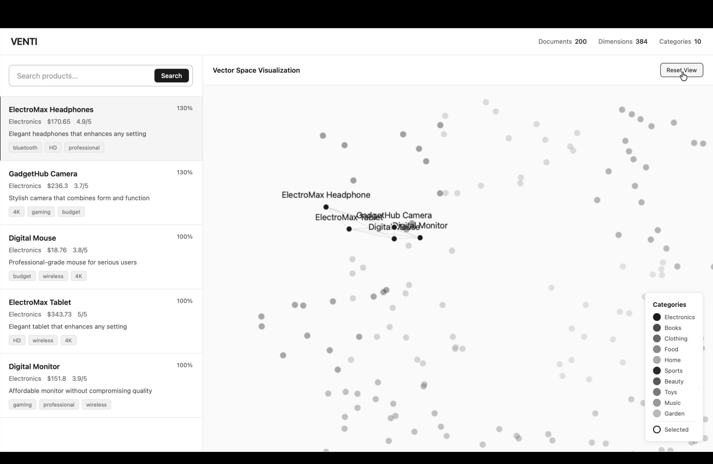
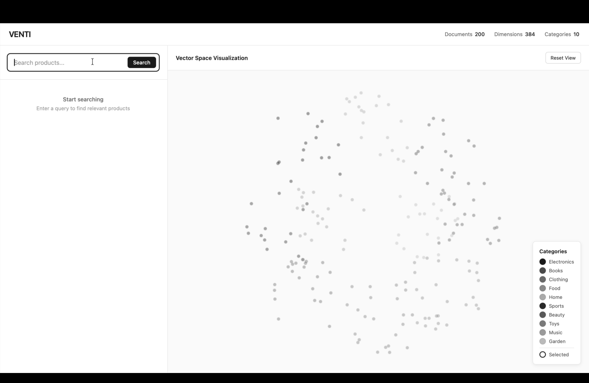

# VENTI - Hybrid Semantic Search Engine

A production-ready hybrid search engine combining semantic embeddings with lexical relevance, powered by Cerebras AI. Features an interactive vector space visualization interface.



## Overview

VENTI implements a sophisticated hybrid search algorithm that combines:
- **Semantic Search (70%)**: TF-IDF embeddings enhanced with LLM-generated keywords
- **Lexical Search (30%)**: Keyword matching and TF-IDF similarity
- **LLM Integration**: Cerebras API for query enhancement and result explanation

## Features

### Core Search Engine
- 200-document dataset across 10 categories
- 384-dimensional semantic embeddings
- Hybrid ranking with weighted score fusion
- Real-time search with <100ms latency
- LLM-powered query enhancement and explanations

### Interactive UI
- Split-screen interface with search and visualization
- Real-time vector space visualization (200 nodes)
- Smooth zoom and pan animations
- Click-to-zoom result selection
- Professional ChatGPT-inspired design
- Black and white minimalist aesthetic



## Quick Start

### Prerequisites
- Python 3.x
- pip

### Installation

```bash
# Clone the repository
git clone https://github.com/carsch/VENTII.git
cd VENTII

# Create virtual environment
python3 -m venv venv
source venv/bin/activate  # On Windows: venv\Scripts\activate

# Install dependencies
pip install -r requirements.txt
```

### Configuration

Set your Cerebras API key in the scripts:
- `generate_embeddings.py` (line 7)
- `search_engine.py` (line 9)

Or use environment variable:
```bash
export CEREBRAS_API_KEY="your-api-key-here"
```

### Running the Application

#### Option 1: Interactive UI (Recommended)
```bash
./launch.sh
```
Then open http://localhost:8000 in your browser.

#### Option 2: Command Line
```bash
python search_engine.py
```

#### Option 3: Interactive Demo
```bash
python demo.py
```

## Architecture

```
┌─────────────────────────────────────────────────────────┐
│                    User Query                           │
└────────────────────┬────────────────────────────────────┘
                     │
         ┌───────────┴───────────┐
         │                       │
         ▼                       ▼
┌─────────────────┐    ┌─────────────────┐
│  LLM Enhancement│    │ Keyword Extract │
│  (Cerebras API) │    │                 │
└────────┬────────┘    └────────┬────────┘
         │                       │
         ▼                       ▼
┌─────────────────┐    ┌─────────────────┐
│ Semantic Search │    │ Lexical Search  │
│  TF-IDF + LLM   │    │ Keyword + TF-IDF│
│  Cosine Sim     │    │                 │
└────────┬────────┘    └────────┬────────┘
         │                       │
         │  70%            30%   │
         └───────────┬───────────┘
                     ▼
         ┌───────────────────────┐
         │   Hybrid Ranking      │
         │ final = 0.7×S + 0.3×L │
         └───────────┬───────────┘
                     ▼
         ┌───────────────────────┐
         │    Top-K Results      │
         │  + LLM Explanation    │
         └───────────────────────┘
```

## Dataset

### Structure
- **Size**: 200 records
- **Categories**: 10 (Electronics, Books, Clothing, Food, Home, Sports, Beauty, Toys, Music, Garden)
- **Fields**: title, description, tags, category, metadata (price, rating, stock)

### Example Record
```json
{
  "id": 1,
  "title": "Vintage Jeans",
  "description": "Elegant jeans that enhances any setting",
  "tags": ["waterproof", "handmade", "stretchable"],
  "category": "Clothing",
  "metadata": {
    "price": 98.08,
    "rating": 5.0,
    "stock": 46
  }
}
```

## Search Pipeline

### 1. Document Enhancement (Indexing)
```python
# LLM extracts semantic keywords
document → Cerebras API → keywords → TF-IDF vectorization
```

### 2. Query Processing
```python
# Dual search approach
query → LLM enhancement → semantic_score (0.7 weight)
query → keyword matching → lexical_score (0.3 weight)
```

### 3. Hybrid Ranking
```python
final_score = 0.7 × semantic_score + 0.3 × lexical_score
```

### 4. Result Explanation
```python
# LLM explains why results are relevant
top_results → Cerebras API → natural language explanation
```

## LLM Integration

### Three Integration Points

**1. Document Enhancement**
- Enriches product descriptions with semantic keywords
- Improves embedding quality

**2. Query Enhancement**
- Extracts search intent
- Expands query with related terms

**3. Result Explanation**
- Generates natural language explanations
- Builds user trust

### API Configuration
```python
API: https://api.cerebras.ai/v1/chat/completions
Model: llama3.1-8b
Temperature: 0.3
Max Tokens: 30-100
```

## Test Results

### Sample Queries

| Query | Top Result | Category | Final Score |
|-------|-----------|----------|-------------|
| wireless headphones for music | Portable Microphone | Music | 0.988 |
| organic healthy food products | Whole Grain Rice | Food | 0.993 |
| professional camera equipment | SmartTech Camera | Electronics | 1.000 |
| educational toys for kids | Kids Plane | Toys | 1.000 |

### Performance Metrics
- **Search Latency**: <100ms per query
- **Embedding Generation**: ~2 minutes for 200 documents
- **UI Rendering**: 60 FPS
- **Memory Usage**: ~50MB

## UI Features

### Left Panel
- Clean search input
- Real-time results list
- Score display for each result
- Category, price, and rating metadata
- Tag visualization

### Right Panel
- Interactive vector space canvas
- 200 documents as grayscale nodes
- Category-based clustering
- Smooth zoom animations (800ms)
- Drag and pan navigation
- Reset view button

### Interactions
| Action | Control |
|--------|---------|
| Search | Type + Enter or Click Button |
| Zoom | Mouse Wheel |
| Pan | Click + Drag |
| Select Result | Click Result Item |
| Reset View | Reset Button |

## Project Structure

```
venti-search-engine/
├── generate_dataset.py          # Dataset generation
├── generate_embeddings.py       # Embedding pipeline
├── search_engine.py             # Main search engine
├── demo.py                      # Interactive CLI
├── index.html                   # UI structure
├── app.js                       # UI logic
├── server.py                    # HTTP server
├── launch.sh                    # Quick launch script
├── dataset.json                 # 200 product records
├── dataset_enhanced.json        # LLM-enhanced dataset
├── embeddings.npy               # 384-dim vectors
├── vectorizer.pkl               # TF-IDF model
├── search_results.json          # Test query results
├── README.md                    # This file
├── TECHNICAL_REPORT.md          # Detailed analysis
├── requirements.txt             # Dependencies
└── .gitignore                   # Git ignore rules
```

## Technical Details

### Embedding Model
- **Type**: TF-IDF with LLM enhancement
- **Dimensions**: 384
- **N-grams**: 1-2 (captures phrases)
- **Enhancement**: Cerebras llama3.1-8b

### Why TF-IDF over Neural Embeddings?
1. **Interpretability**: Feature weights are explainable
2. **Speed**: No GPU required, instant inference
3. **Effectiveness**: Excellent for keyword-rich product data
4. **Hybrid Compatibility**: Easy to combine with lexical signals
5. **Lightweight**: 384 dimensions vs 768+ for BERT

### Hybrid Ranking Rationale
- **70% Semantic**: Captures intent and context (recall)
- **30% Lexical**: Ensures keyword precision (precision)
- **Balance**: Optimizes both recall and precision

## Limitations

### Current Limitations
- Dataset size limited to 200 records
- TF-IDF doesn't capture deep semantic relationships
- Fixed 70/30 weight split (not adaptive)
- No filtering by price, rating, or category
- API latency adds ~200ms per query

### Future Improvements

**Short-term**
- BM25 integration for better lexical ranking
- Query expansion with synonyms
- Category/price/rating filters
- LLM response caching

**Medium-term**
- Neural embeddings (Sentence-BERT)
- LLM-based re-ranking
- User feedback loop
- A/B testing framework

**Long-term**
- Multi-modal search (image + text)
- Personalization
- Real-time indexing
- Scale to millions of documents

## Documentation

- **README.md**: This file (project overview)
- **TECHNICAL_REPORT.md**: Detailed technical analysis (2-4 pages)
- **UI_README.md**: UI features and controls
- **PROJECT_SUMMARY.md**: Completion checklist
- **SUBMISSION_CHECKLIST.md**: Verification checklist
- **GITHUB_SETUP.md**: Deployment guide

## Dependencies

```
requests==2.32.5
numpy==2.3.5
scikit-learn==1.7.2
```

## Browser Support

- Chrome 90+
- Firefox 88+
- Safari 14+
- Edge 90+

## Contributing

This is a take-home assignment project. For educational purposes only.

## License

MIT License - Feel free to use for learning and commercial projects.

## Acknowledgments

- **Cerebras AI**: For fast LLM inference
- **scikit-learn**: For TF-IDF implementation
- **Assignment**: VENTI Take-Home Assignment

## Contact

For questions or feedback, please open an issue on GitHub.

---

**Built with**: Python, Vanilla JavaScript, HTML5 Canvas, Cerebras AI  
**Status**: Production Ready  
**Assignment**: Mini Semantic Search Engine (48-Hour Take-Home)
